# DevOps Node.js CI/CD Pipeline

A complete DevOps project demonstrating infrastructure provisioning, configuration management, application deployment, and CI/CD automation on AWS.

## Overview

This project provisions an AWS EC2 instance using Terraform, configures the server using Ansible roles, deploys a Node.js application behind Nginx, manages application processes using PM2, and automates deployments through GitHub Actions.

## Architecture

```text
                           Git Push
                               │
                               ▼
                      GitHub Repository
                               │
                               ▼
                        GitHub Actions
                               │
                               ▼
                         SSH Deployment
                               │
                               ▼
+--------------------------------------------------+
|                 AWS EC2 Instance                 |
|--------------------------------------------------|
| Ubuntu Linux                                     |
|                                                  |
| Nginx (Port 80)                                  |
|        │                                         |
|        ▼                                         |
| Node.js Application (Port 3000)                  |
|        │                                         |
|        ▼                                         |
| PM2 Process Manager                              |
+--------------------------------------------------+
```

## Technologies Used

* AWS EC2
* Terraform
* Ansible
* Nginx
* Node.js
* PM2
* GitHub Actions
* Ubuntu Linux

## Project Structure

```text
.
├── terraform/
├── ansible/
│   ├── inventory.ini
│   ├── setup.yml
│   └── roles/
│       ├── base/
│       ├── nginx/
│       ├── nodejs/
│       └── app/
├── app/
├── assets/
└── .github/
    └── workflows/
```

## Infrastructure Provisioning

Terraform is used to provision the EC2 instance.

Features:

* Infrastructure as Code (IaC)
* Automated EC2 provisioning
* Public IP assignment
* SSH access configuration

## Server Configuration

Ansible is used for server configuration through reusable roles.

### Base Role

Installs and configures:

* Git
* Curl
* Vim
* Htop
* Unzip
* Fail2Ban

### Nginx Role

* Installs Nginx
* Configures reverse proxy
* Enables site configuration
* Uses handlers for service restart

### Node.js Role

Installs:

* Node.js
* npm
* PM2

### App Role

* Clones the repository
* Installs dependencies
* Starts the application using PM2

## Application

The application is a simple Express.js service exposing:

* `/`
* `/health`

PM2 is used to:

* Manage application processes
* Restart crashed processes
* Persist processes across reboots

## CI/CD Pipeline

Deployment is automatically triggered when code is pushed to the `main` branch.

Workflow:

1. Push code to GitHub
2. GitHub Actions workflow starts
3. Workflow connects to EC2 through SSH
4. Latest code is pulled
5. Dependencies are installed
6. Application is restarted through PM2

## Reverse Proxy

Nginx listens on port 80 and forwards requests to the Node.js application running on port 3000.

```text
Client
   │
   ▼
Nginx :80
   │
   ▼
Node.js :3000
```

---

# Screenshots

## Ansible Inventory Connectivity

Successful connection between Ansible control node and EC2 instance.

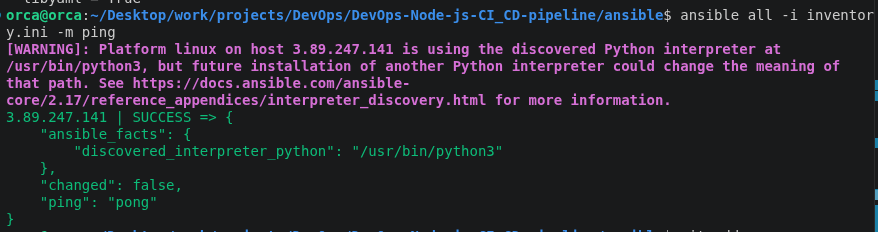

---

## Base Role Execution

Base server configuration and package installation.

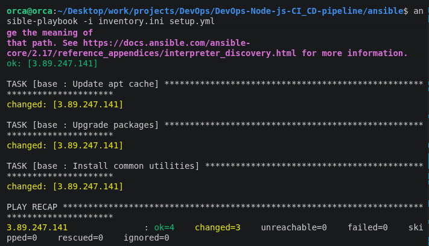

Server verification after base role execution.

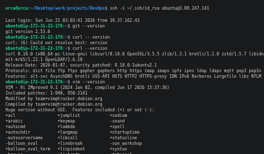

System monitoring using htop.

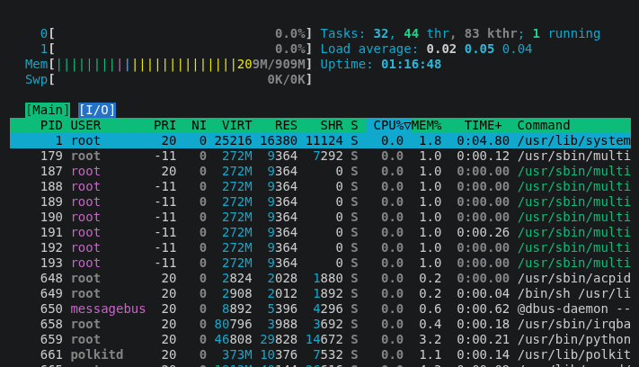

---

## Nginx Role

Nginx installation using Ansible.

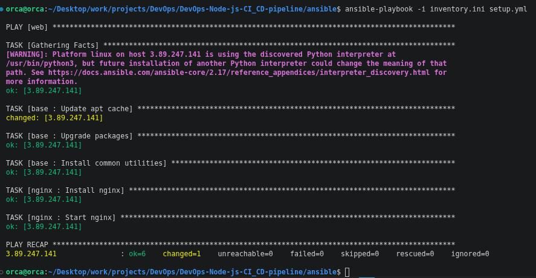

Nginx service verification on the EC2 server.

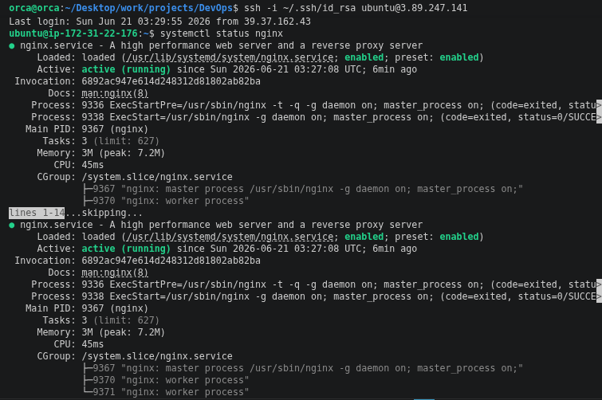

Default Nginx page before reverse proxy configuration.

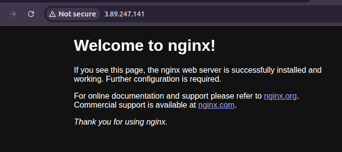

Application accessible through Nginx reverse proxy.

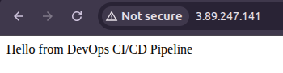

---

## Node.js Role

Node.js, npm and PM2 installation through Ansible.

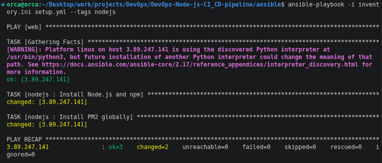

Verification of installed runtime components.

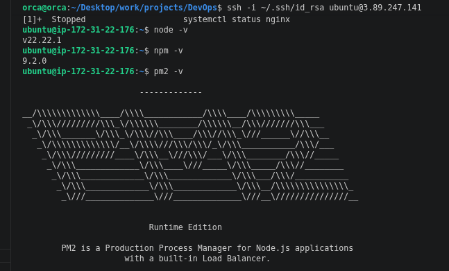

---

## Application Deployment

Application deployment role execution.

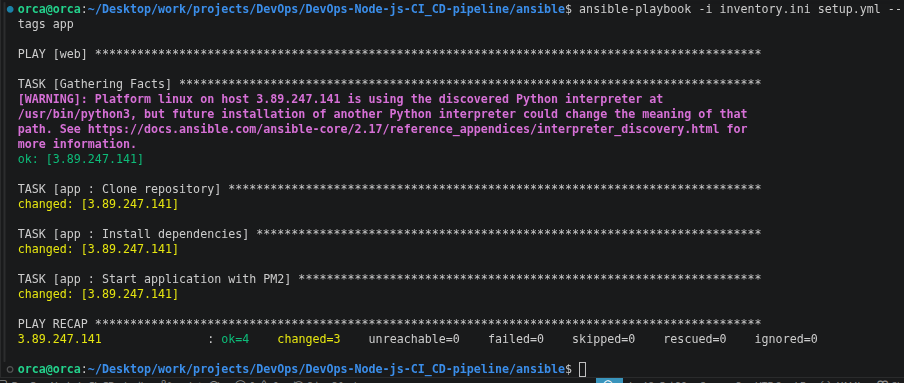

Application responding locally on port 3000.

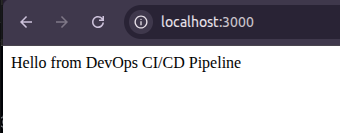

Health endpoint verification.

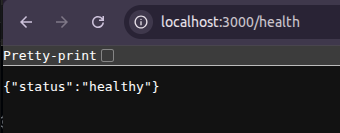

PM2 process management and persistence.

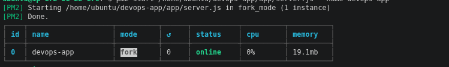

---

## GitHub Actions CI/CD

Workflow execution in progress.

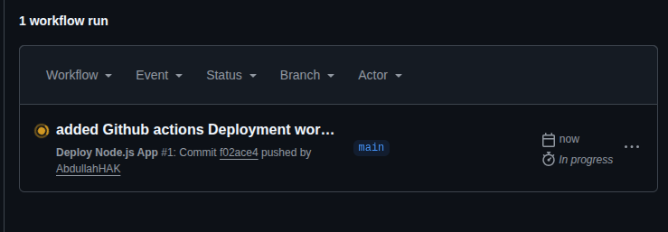

Successful deployment workflow completion.

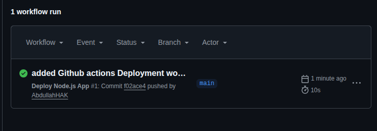

---

## Key Learnings

* Infrastructure provisioning using Terraform
* Configuration management with Ansible
* Linux server administration
* Reverse proxy configuration using Nginx
* Node.js deployment and process management
* PM2 startup persistence
* CI/CD automation using GitHub Actions
* AWS EC2 operations
* SSH-based deployment workflows

## Future Improvements

* HTTPS with Let's Encrypt
* Custom domain integration
* Docker containerization
* Monitoring and logging stack
* Multi-environment deployments
* Blue-Green deployment strategy
